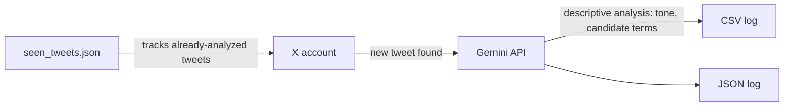

# social-sentiment-tracker

Read-only analytics tool that polls a public X (Twitter) account's tweets and uses Google's free Gemini API to flag any mentions of tickers, coin names, or trending internet culture references — logging the analysis to CSV and JSON for later review.

**This is a research tool, not a trading bot.** It does not place trades, does not touch any wallet, and does not post or reply on anyone's behalf. Output is meant to be reviewed by a person, not acted on automatically.

## How it works



1. Every 15 minutes, the script checks the target account's recent tweets.
2. Each new tweet's text is sent to Gemini, which returns a plain descriptive analysis: whether it references a ticker/meme, candidate terms, tone, and a one-sentence summary.
3. The analysis is appended to both a CSV and a JSON log for review.
4. Already-analyzed tweets are tracked locally so nothing gets logged twice.

## Setup

1. Get X API credentials at [developer.x.com](https://developer.x.com) — create a project/app and generate a Bearer Token.
2. Get a free Gemini API key at [aistudio.google.com/apikey](https://aistudio.google.com/apikey).
3. Fill in `X_BEARER_TOKEN`, `TARGET_USERNAME`, and `GEMINI_API_KEY` at the top of `social_sentiment_tracker.py` (or set them as environment variables).

## Usage

```bash
pip install -r requirements.txt
python social_sentiment_tracker.py
```

The script runs in an endless loop, checking every 15 minutes by default. Stop it with `Ctrl+C`.

## Notes

- X's free API tier has strict rate limits, so this script polls infrequently by default. Lower `CHECK_INTERVAL_SECONDS` only if you have a paid X API tier.
- Gemini's output is descriptive research, not financial advice — "trending" flags should never be treated as buy/sell signals.
- `TARGET_USERNAME` can be set to any public X account, not just crypto-related ones.
